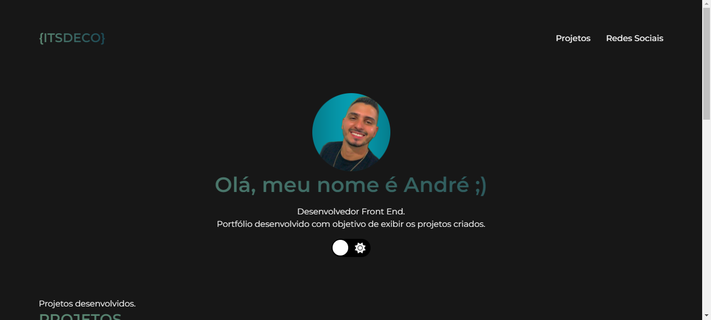

<h1 align="center"> Meu Portfólio </h1>

  

## 🚀 Tecnologias

Esse projeto foi desenvolvido com as seguintes tecnologias:

- HTML e CSS
- JavaScript
- Git e Github

## 💻 Projeto

O portfólio desenvolvido com minhas informações e contatos.

- [Acesse o projeto finalizado, online](https://andrelucasr97.github.io/meuportfolio)

## :memo: Licença

Esse projeto está sob a licença MIT.

Feito com ♥ by André Lucas.